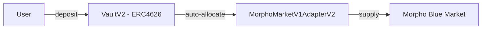
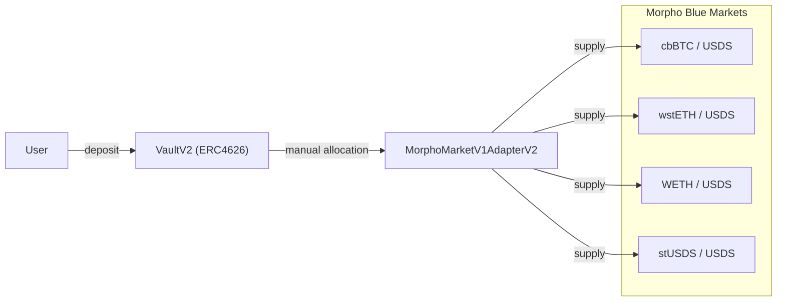

# [Template test] Technical scope for non-spell (Morpho Vault deployment)

> [!IMPORTANT]
> Source technical scope: https://hackmd.io/@b7L--GszSxO5h1-wpkPN-Q/Hk6J_hg5bl

> [!NOTE]
> ### Notes on the test of the template
> - The **[ADDED]** marker is used to highlight parts that are missing in the original doc and were written by us.
> - The **[SKIPPED]**/**[MISSING]** marker is used to avoid populating a lot of missing information, since the structure will follow the same format as already illustrated.

## Introduction

### Goal of this update

Deploy five Morpho Vault V2 instances operated by the sky.money curator on Ethereum mainnet, allowing users to deposit stablecoins (USDS, USDC, USDT) and earn yield through lending on Morpho Blue markets collateralized by Sky ecosystem assets (stUSDS, sUSDS) and blue-chip crypto assets (cbBTC, wstETH, WETH).

### Required context

- These deployments were carried out by Soter Labs on behalf of the Prime Agent [Skybase](https://forum.skyeco.com/t/technical-scope-of-the-new-skybase-agent/27642)
- The sky.money curator is controlled by Skybase
- All vaults, adapters, and oracles were deployed using Morpho's official factory contracts (VaultV2Factory, AdapterFactory, OracleFactory)
- Canonical factory addresses: https://docs.morpho.org/get-started/resources/addresses/#morpho-v2-contracts
- All deployment scripts, tests, and configurations are open-source: https://github.com/soterlabs/morpho-vault-v2-deployment

### The reason(s) behind this update

**[ADDED]** Skybase expansion into new markets.

### Timing of this update (in stages, if needed)

All vault deployments were already performed.

## Relevant audits

**[ADDED]** All listed contracts were deployed via Morpho's official factory contracts. No contract was directly deployed by a deployer.

## Trusted addresses

| Contract name | Address with URL | Source URL |
|---|---|---|
| Morpho | [`0xBBBBBbbBBb9cC5e90e3b3Af64bdAF62C37EEFFCb`](https://etherscan.io/address/0xBBBBBbbBBb9cC5e90e3b3Af64bdAF62C37EEFFCb) | [Morpho V1 Contracts](https://docs.morpho.org/get-started/resources/addresses/#morpho-v1-contracts) |
| VaultV2Factory | [`0xA1D94F746dEfa1928926b84fB2596c06926C0405`](https://etherscan.io/address/0xA1D94F746dEfa1928926b84fB2596c06926C0405) | [Morpho V2 Contracts](https://docs.morpho.org/get-started/resources/addresses/#morpho-v2-contracts) |
| MorphoChainlinkOracleV2Factory | [`0x3A7bB36Ee3f3eE32A60e9f2b33c1e5f2E83ad766`](https://etherscan.io/address/0x3A7bB36Ee3f3eE32A60e9f2b33c1e5f2E83ad766) | [Morpho V1 Contracts](https://docs.morpho.org/get-started/resources/addresses/#morpho-v1-contracts) |
| MorphoMarketV1AdapterV2Factory | [`0x32BB1c0D48D8b1B3363e86eeB9A0300BAd61ccc1`](https://etherscan.io/address/0x32BB1c0D48D8b1B3363e86eeB9A0300BAd61ccc1) | [Morpho V2 Contracts](https://docs.morpho.org/get-started/resources/addresses/#morpho-v2-contracts) |
| RegistryList | [`0x3696c5eAe4a7Ffd04Ea163564571E9CD8Ed9364e`](https://etherscan.io/address/0x3696c5eAe4a7Ffd04Ea163564571E9CD8Ed9364e) | [Morpho V2 Contracts](https://docs.morpho.org/get-started/resources/addresses/#morpho-v2-contracts) |
| AdaptiveCurveIrm | [`0x870aC11D48B15DB9a138Cf899d20F13F79Ba00BC`](https://etherscan.io/address/0x870aC11D48B15DB9a138Cf899d20F13F79Ba00BC) | [Morpho V1 Contracts](https://docs.morpho.org/get-started/resources/addresses/#morpho-v1-contracts) |
| **[ADDED]** SafeProxy (sky.money curator controlled by Skybase) | [`0x3F32bC09d41eE699844F8296e806417D6bf61Bba`](https://etherscan.io/address/0x3F32bC09d41eE699844F8296e806417D6bf61Bba#code) | [Sky Atlas](https://sky-atlas.io/#615835d8-475b-48f6-9e0f-bcaf041a63ff) |

## Pre-deployed contracts

### sky.money USDS Risk Capital

1. **VaultV2**
    - Chain name: Ethereum Mainnet
    - Contract address: [0xf42bca228D9bd3e2F8EE65Fec3d21De1063882d4](https://etherscan.io/address/0xf42bca228D9bd3e2F8EE65Fec3d21De1063882d4)
    - Deployment transaction: [tx](https://etherscan.io/tx/0x9433e876a034e9a00d5fe83ff321023edbea9a82b108874feb422b5d8b096aef)
    - Code verification
        - If deployed by a factory
            - Contract being called: `VaultV2Factory`
            - External docs page with this address: [Morpho V2 docs](https://docs.morpho.org/get-started/resources/addresses/#morpho-v2-contracts)
            - **[ADDED]** Function being called: [`createVaultV2(address owner, address asset, bytes32 salt)`](https://etherscan.io/address/0xA1D94F746dEfa1928926b84fB2596c06926C0405#code#F1#L14)
            - **[ADDED]** Function arguments:
                1. `address owner`
                    - Argument value: `0xcFF1ADB9E91e69E5Bf05E324DedC558Dcf7F5E34`
                    - External source of the value or an explanation of how this value can be verified, and who has to confirm it: the deployer
                2. `address asset`
                    - Argument value: `0xdC035D45d973E3EC169d2276DDab16f1e407384F`
                    - External source of the value or an explanation of how this value can be verified, and who has to confirm it: USDS token from chainlog
                3. `bytes32 salt`
                    - Argument value: `0x809532779d0622b4d7051d65b57d597a83157c25d3b021ecc1bcfb9861d7e2e9`
                    - External source of the value or an explanation of how this value can be verified, and who has to confirm it: not explained or listed in the forum post
    - Additional parameters configured on the contract by a privileged actor:
        - **[ADDED]** No additional transactions were made
    - Ownership, roles, privilege callers:
        1. Owner
            - What actions can this role perform: Set curator, sentinels, transfer ownership
            - Address: [`0x3F32bC09d41eE699844F8296e806417D6bf61Bba`](https://etherscan.io/address/0x3F32bC09d41eE699844F8296e806417D6bf61Bba)
            - External source of the address or an explanation of how this address can be verified, and who has to confirm it: **[MISSING]**
        2. Curator
            - What actions can this role perform: Timelocked actions: adapters, caps, allocators
            - Address: [`0x3F32bC09d41eE699844F8296e806417D6bf61Bba`](https://etherscan.io/address/0x3F32bC09d41eE699844F8296e806417D6bf61Bba)
            - External source of the address or an explanation of how this address can be verified, and who has to confirm it: **[MISSING]**
        3. Sentinel
            - What actions can this role perform: Revoke pending actions, emergency controls
            - Address: [`0x3F32bC09d41eE699844F8296e806417D6bf61Bba`](https://etherscan.io/address/0x3F32bC09d41eE699844F8296e806417D6bf61Bba)
            - External source of the address or an explanation of how this address can be verified, and who has to confirm it: **[MISSING]**
    - Source code verified on block explorer: **[ADDED]** Yes
    - The deployer no longer has a privileged role: **[ADDED]** Yes

2. **MorphoChainlinkOracleV2**
    - Chain name: Ethereum Mainnet
    - Contract address: [0x0A976226d113B67Bd42D672Ac9f83f92B44b454C](https://etherscan.io/address/0x0A976226d113B67Bd42D672Ac9f83f92B44b454C)
    - Deployment transaction: [tx](https://etherscan.io/tx/0xdccc7ebbcbbff04484b2156993cf94b9f4a2c8d6c6424bbd8efced6afa6be2bc)
    - Code verification
        - If deployed by a factory
            - Contract being called: [MorphoChainlinkOracleV2Factory](https://etherscan.io/address/0x3A7bB36Ee3f3eE32A60e9f2b33c1e5f2E83ad766#code)
            - External docs page with this address: [Morpho V2 docs](https://docs.morpho.org/get-started/resources/addresses/#morpho-v2-contracts)
            - **[ADDED]** Function being called: [`createMorphoChainlinkOracleV2(IERC4626 baseVault, uint256 baseVaultConversionSample, AggregatorV3Interface baseFeed1, AggregatorV3Interface baseFeed2, uint256 baseTokenDecimals, IERC4626 quoteVault, uint256 quoteVaultConversionSample, AggregatorV3Interface quoteFeed1, AggregatorV3Interface quoteFeed2, uint256 quoteTokenDecimals, bytes32 salt)`](https://etherscan.io/address/0x3A7bB36Ee3f3eE32A60e9f2b33c1e5f2E83ad766#code#F1#L25)
            - **[ADDED]** Function arguments:
                1. `IERC4626 baseVault`
                    - Argument value: `0x99CD4Ec3f88A45940936F469E4bB72A2A701EEB9`
                    - External source of the value or an explanation of how this value can be verified, and who has to confirm it: `STUSDS` from chainlog
                2. `uint256 baseVaultConversionSample`
                    - Argument value: `1_000000000000000000`
                    - External source of the value or an explanation of how this value can be verified, and who has to confirm it: No conversion
                3. `AggregatorV3Interface baseFeed1`
                    - Argument value: `0x0000000000000000000000000000000000000000`
                    - External source of the value or an explanation of how this value can be verified, and who has to confirm it: No base feed 1
                4. `AggregatorV3Interface baseFeed2`
                    - Argument value: `0x0000000000000000000000000000000000000000`
                    - External source of the value or an explanation of how this value can be verified, and who has to confirm it: No base feed 1
                5. `uint256 baseTokenDecimals`
                    - Argument value: `18`
                    - External source of the value or an explanation of how this value can be verified, and who has to confirm it: [stUSDS decimals](https://etherscan.io/address/0x99cd4ec3f88a45940936f469e4bb72a2a701eeb9#readProxyContract#F12)
                6. `IERC4626 quoteVault`
                    - Argument value: `0x0000000000000000000000000000000000000000`
                    - External source of the value or an explanation of how this value can be verified, and who has to confirm it: No quote vault
                7. `uint256 quoteVaultConversionSample`
                    - Argument value: `1`
                    - External source of the value or an explanation of how this value can be verified, and who has to confirm it: No conversion
                8. `AggregatorV3Interface quoteFeed1`
                    - Argument value: `0x0000000000000000000000000000000000000000`
                    - External source of the value or an explanation of how this value can be verified, and who has to confirm it: No quote feed 1
                9. `AggregatorV3Interface quoteFeed2`
                    - Argument value: `0x0000000000000000000000000000000000000000`
                    - External source of the value or an explanation of how this value can be verified, and who has to confirm it: No quote feed 1
                10. `uint256 quoteTokenDecimals`
                    - Argument value: `18`
                    - External source of the value or an explanation of how this value can be verified, and who has to confirm it: Same decimals as stUSDS
                11. `bytes32 salt`
                    - Argument value: `0xb273084bcea4c0f298787a8fc48968cb206800e11655722046f47c47d78a8a27`
                    - External source of the value or an explanation of how this value can be verified, and who has to confirm it: Random value
    - Additional parameters configured on the contract by a privileged actor: **[ADDED]** None
    - Ownership, roles, privilege callers: **[ADDED]** None
    - Source code is verified on the block explorer: **[ADDED]** Yes
    - The deployer no longer has a privileged role: **[ADDED]** Yes

3. **MorphoMarketV1AdapterV2**
    - Contract name: MorphoMarketV1AdapterV2
    - Chain name: Ethereum Mainnet
    - Contract address: [0xaaf8Bf4B6E8cCb74B7f5E96D4A27fF967c1eEF74](https://etherscan.io/address/0xaaf8Bf4B6E8cCb74B7f5E96D4A27fF967c1eEF74)
    - Deployment transaction: [tx](https://dashboard.tenderly.co/tx/0x3514a7874e9a3f3364ba1c523597b49223611022245fe25d4f92711215a71050)
    - Code verification
        - If deployed by a factory
            - Contract being called: [MorphoMarketV1AdapterV2Factory](https://etherscan.io/address/0x32BB1c0D48D8b1B3363e86eeB9A0300BAd61ccc1)
            - External docs page with this address: [Morpho V2 docs](https://docs.morpho.org/get-started/resources/addresses/#morpho-v2-contracts)
            - Function being called: [`createMorphoMarketV1AdapterV2(address parentVault)`](https://etherscan.io/address/0x32BB1c0D48D8b1B3363e86eeB9A0300BAd61ccc1#code#F1#L31)
            - Function arguments:
                1. `address parentVault`
                    - Argument value: `0xf42bca228D9bd3e2F8EE65Fec3d21De1063882d4`
                    - External source of the value or an explanation of how this value can be verified, and who has to confirm it: **[ADDED]** VaultV2 from above
    - Additional parameters configured on the contract by a privileged actor: **[ADDED]** None
    - Ownership, roles, privilege callers: **[ADDED]** None
    - Source code is verified on the block explorer: **[ADDED]** Yes
    - The deployer no longer has a privileged role: **[ADDED]** Yes

### sky.money USDC Risk Capital

1. **VaultV2**

    **[SKIPPED]**

2. **MorphoChainlinkOracleV2**

    **[SKIPPED]**

3. **MorphoMarketV1AdapterV2**

    **[SKIPPED]**

### sky.money USDT Risk Capital

1. **VaultV2**

    **[SKIPPED]**

2. **MorphoChainlinkOracleV2**

    **[SKIPPED]**

3. **MorphoMarketV1AdapterV2**

    **[SKIPPED]**

### sky.money USDT Savings

1. **VaultV2**

    **[SKIPPED]**

2. **MorphoChainlinkOracleV2 (Pre-existing)**

    **[SKIPPED]**

3. **MorphoMarketV1AdapterV2**

    > **Note:** This vault reuses an existing sUSDS/USDT market on Morpho Blue. No new oracle or market was created, only the vault and adapter were deployed.

    **[SKIPPED]**

### sky.money USDS Flagship

1. **VaultV2**

    **[SKIPPED]**

2. **MorphoMarketV1AdapterV2**

    **[SKIPPED]**

## Pre-configurations
**[ADDED]** No additional pre-configurations were made by the deployer.

## Pre-requirements
**[ADDED]** No specific pre-requirements.

## Proposed actions
**[ADDED]** Announce the deployments to users.

## Post-checks

1. **[ADDED]** Ensure the correctness of the scripts
    - What will be done: Run deployment scripts in-memory on an Anvil fork. Verify scripts produce correct vault configuration, oracle parameters, market creation, and deposit/withdraw operations.
    - How it will be done: By a script located in: [morpho-vault-v2-deployment/test](https://github.com/soterlabs/morpho-vault-v2-deployment/tree/393f3a640fef8795927c0f8011d71025dcd83e5e/test) (pattern: `vault_name/DeployVaultNameScript.t.sol`)
    - Expected outcome: No errors.
    - Who will perform this action: The deployer.

2. **[ADDED]** Ensure the correctness of the deployed contracts
    - What will be done: Run against already-deployed contracts on mainnet (pinned to deployment block)
    - How it will be done: Modify and run a test in: [morpho-vault-v2-deployment/test](https://github.com/soterlabs/morpho-vault-v2-deployment/tree/393f3a640fef8795927c0f8011d71025dcd83e5e/test) (pattern: `vault_name/DeployedVaultNameVault.t.sol`)
    - Expected outcome: on-chain state matches expected configuration
    - Who will perform this action: The deployer.

## Technical risk self-assessment

1. **ERC4626 Inflation Attack: Share manipulation attacks on ERC4626 vaults**
    - Applied mitigations: Each vault is initialized with a "dead deposit":
        - 18-decimal vaults (USDS): 1e18 (1 USDS)
        - 6-decimal vaults (USDC, USDT): 1e6 (1 USDC/USDT)

2. **IRM Convergence Risk: Adaptive IRM may not converge to reasonable rates quickly without initial utilization**
    - Risk description: Adaptive IRM may not converge to reasonable rates quickly without initial utilization
    - Applied mitigations: Single-market vaults bootstrap 90% market utilization via dead collateral + borrow

3. **Runaway Interest Rates: Interest rates could spike to extremely high levels**
    - Applied mitigations: All markets use `MAX_RATE = 63419583967` (~200% APR) cap

4. **USDT Non-Standard Approval: USDT's `approve()` function does not return a boolean, which could cause transaction failures**
    - Applied mitigations: All USDT interactions use OpenZeppelin's `SafeERC20.forceApprove()`

5. **Manual allocation could lead to suboptimal capital deployment (USDS Flagship only)**
    - Applied mitigations:
        - Allocation caps: 20% max to the adapter (aggregate), 5% max per individual market
        - Allocator bot via Safe 1/3 multisig

## Emergency actions

1. **Sentinel role can revoke pending actions**
    - When to do: When pending time-locked actions need to be revoked, or emergency intervention is required
    - How to do it: Sentinel msig ([`0x3F32bC09d41eE699844F8296e806417D6bf61Bba`](https://etherscan.io/address/0x3F32bC09d41eE699844F8296e806417D6bf61Bba)) can revoke pending actions by calling **[SKIPPED]**
    - Known side-effects: **[MISSING]**
    - Is covered by monitoring: **[MISSING]**

## Monitoring
**[MISSING]**

## Research and additional notes

### Single-Market Vaults (Risk Capital + USDT Savings)

- **VaultV2**: ERC4626-compliant vault created via `VaultV2Factory`
- **MorphoMarketV1AdapterV2**: Connects the vault to a single Morpho Blue market
- **Liquidity Adapter**: Set on the vault so deposits are automatically allocated to the lending market

### USDS Flagship Vault (Multi-Market, Manual Allocation)

- **No liquidity adapter**: The vault does **not** auto-allocate. Capital allocation is managed manually.
- **4 markets**: stUSDS/USDS, cbBTC/USDS, wstETH/USDS, WETH/USDS (all 86% LLTV)
- **Allocator bot**: A TypeScript bot allocates capital via a Safe 1/3 multisig (threshold=1), where the bot is one of the 3 signers. Transactions are routed through Safe's `execTransaction`.

### Incentives

All incentives are distributed via [Merkl](https://app.merkl.xyz/):

| Vault | Merkl Campaigns | Subsidy Schedule |
|---|---|---|
| USDS Risk Capital | [Link](https://app.merkl.xyz/opportunities/ethereum/ERC20LOGPROCESSOR/0xf42bca228D9bd3e2F8EE65Fec3d21De1063882d4) | W1: 30k USDS, W2: 15k USDS, W3+: Integration Boost only |
| USDC Risk Capital | [Link](https://app.merkl.xyz/opportunities/ethereum/ERC20LOGPROCESSOR/0x56bfa6f53669B836D1E0Dfa5e99706b12c373ecf) | W1: 30k USDS, W2: 20k USDS, W3-5: 10k USDC |
| USDT Risk Capital | [Link](https://app.merkl.xyz/opportunities/ethereum/ERC20LOGPROCESSOR/0x2bD3A43863c07B6A01581FADa0E1614ca5DF0E3d) | W1: 30k USDS, W2: 20k USDS, W3-5: 10k USDT |
| USDS Flagship | [Link](https://app.merkl.xyz/opportunities/ethereum/ERC20LOGPROCESSOR/0xE15fcC81118895b67b6647BBd393182dF44E11E0) | W1: 50k USDS, W2: 50k USDS, W3-6: 25k USDS, W7-8: 20k USDS, W9+: Integration Boost only |
| USDT Savings | [Link](https://app.merkl.xyz/opportunities/ethereum/ERC20LOGPROCESSOR/0x23f5E9c35820f4baB695Ac1F19c203cC3f8e1e11) | W1: 50k USDT, W2: 50k USDT, W3-6: 25k USDT, W7-8: 20k USDT |

### Links

- Curator page: https://app.morpho.org/curator/sky-money
- Skybase Prime Agent: https://forum.skyeco.com/t/technical-scope-of-the-new-skybase-agent/27642
- Morpho Blue: https://morpho.org/
- Morpho V2 contract addresses: https://docs.morpho.org/get-started/resources/addresses/#morpho-v2-contracts
- Sky Ecosystem: https://sky.money/
- Deployment repository: https://github.com/soterlabs/morpho-vault-v2-deployment
- Morpho forum announcement: https://forum.morpho.org/t/announcing-the-sky-money-usdt-savings-vault-usds-flagship-vault/2199
